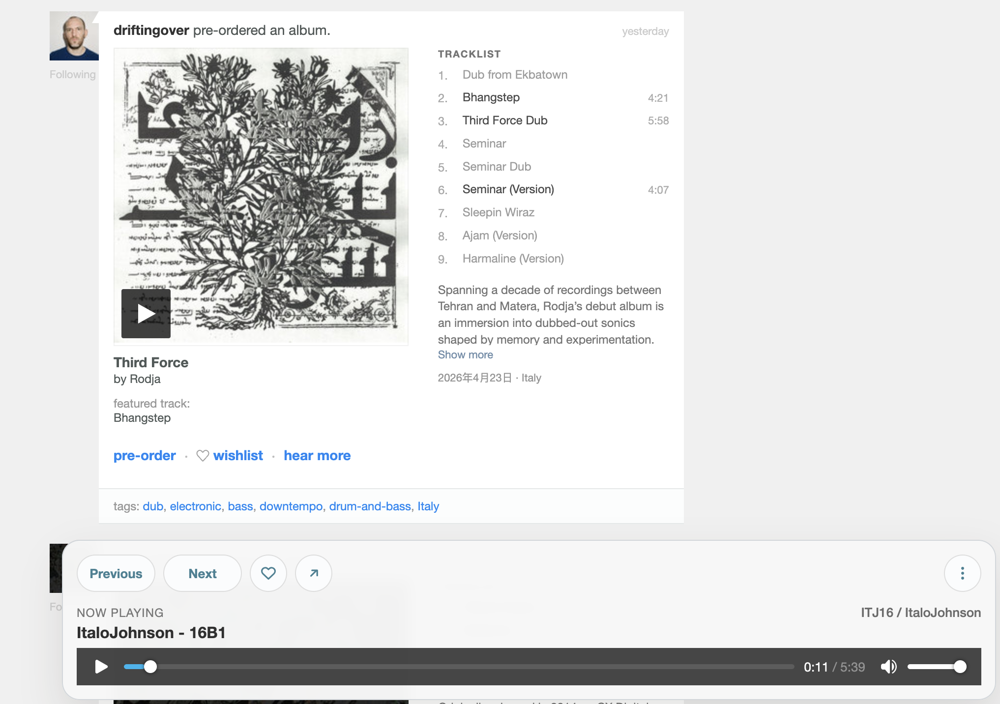

# Bandcamplifer

Bandcamplifer is an open source userscript and browser extension that makes the Bandcamp fan feed much more usable. It pulls release context into feed cards, shows inline tracklists, adds playback controls, and keeps Bandcamp-native wishlist and buy shortcuts close at hand.



## Highlights

- Enriches feed cards with release metadata loaded from linked album or track pages
- Replaces the `supported by` column with a readable inline tracklist on compatible cards
- Lets you play tracks from the feed and keeps a persistent bottom player in sync
- Adds per-track `wish` actions in the inline tracklist
- Opens Bandcamp's native buy dialog from the feed without automating the final purchase step
- Merges adjacent duplicate `bought a track` cards for the same fan and release

## Project Layout

- [`bcamplifier.user.js`](./bcamplifier.user.js): release userscript and shared core logic
- [`bcamplifier.dev.user.js`](./bcamplifier.dev.user.js): local Tampermonkey dev loader
- [`manifest.chrome.json`](./manifest.chrome.json): Chrome extension manifest
- [`manifest.firefox.json`](./manifest.firefox.json): Firefox extension manifest
- [`extension.content.js`](./extension.content.js): extension adapter for the shared core
- [`extension.background.js`](./extension.background.js): extension background bridge
- [`scripts/`](./scripts): build and verification helpers

## Installation

### Userscript

Bandcamplifer ships as a Tampermonkey userscript through the public Bandcamplifer release you distribute. For local testing or self-hosting, the repository release file is [`bcamplifier.user.js`](./bcamplifier.user.js).

The release userscript:

- keeps the full `@match` scope required by feed, album, and track helper flows
- no longer points to local `127.0.0.1` update metadata
- preserves Bandcamp-native `buy` support

Why the broad `@match` is still needed:

- the feed UI runs on `bandcamp.com`
- release pages run on `*.bandcamp.com`
- wishlist and buy helpers need to execute in the real Bandcamp release-page context

### Browser Extension

The extension build is currently the secondary distribution target built from the same shared core.

Build the browser-specific packages:

```sh
./scripts/build-extension.sh
```

This produces:

- `dist/bcamplifier-chrome.zip`
- `dist/bcamplifier-firefox.xpi`

Load locally:

- Chrome: open `chrome://extensions`, enable Developer mode, click `Load unpacked`, then select `dist/chrome`
- Firefox: open `about:debugging#/runtime/this-firefox`, click `Load Temporary Add-on`, then select [`dist/firefox/manifest.json`](./dist/firefox/manifest.json)

## Permissions And Behavior

The userscript uses:

- `GM_xmlhttpRequest`
- `GM_getValue`
- `GM_setValue`

It can:

- fetch Bandcamp release HTML to parse metadata
- cache parsed release data locally
- create hidden helper iframes for some authenticated per-track actions
- open a Bandcamp tab for `buy` and trigger Bandcamp's native purchase dialog there

It can affect Bandcamp account state only when the user explicitly clicks a control such as:

- per-track `wish`
- the bottom-player wishlist button

It does not auto-buy anything. The `buy` shortcut opens Bandcamp's own UI and leaves final confirmation to the user.

## Local Development

Use the dev loader during active work:

- [`bcamplifier.dev.user.js`](./bcamplifier.dev.user.js)

Start a local server from the repository root:

```sh
python3 -m http.server 8000 --bind 127.0.0.1
```

Then install the dev loader in Tampermonkey. It uses `@require` to pull the local working copy.

The dev loader:

- keeps its own local `@updateURL` and `@downloadURL`
- points `@require` at `http://127.0.0.1:8000/bcamplifier.user.js`
- matches the same Bandcamp page scope as the release script so helper flows still work during development

Recommended workflow:

1. Keep `bcamplifier.user.js` as the release-style script.
2. Use `bcamplifier.dev.user.js` while iterating locally.
3. Bump `@version` in `bcamplifier.user.js` when you want Tampermonkey to detect a fresh release build.

## Validation

Run the core checks from the repository root:

```sh
node --check bcamplifier.user.js
./scripts/check-extension-scope.sh
./scripts/build-extension.sh
./scripts/smoke-test-extension.sh
./scripts/test-feed-fixture.sh
```

The verification helpers are:

- [`scripts/check-extension-scope.sh`](./scripts/check-extension-scope.sh): locks extension scope to the intended Bandcamp URLs
- [`scripts/smoke-test-extension.sh`](./scripts/smoke-test-extension.sh): checks that the Chrome build loads without manifest-level errors
- [`scripts/test-feed-fixture.sh`](./scripts/test-feed-fixture.sh): serves a local fixture and verifies that the shared core injects enhancement UI

## Configuration

Edit the `CONFIG` object near the top of [`bcamplifier.user.js`](./bcamplifier.user.js) to tune behavior:

- `autoFetchOnVisible`
- `expandAfterAutoFetch`
- `cacheTtlMs`
- `maxTracks`
- `maxDescriptionLength`
- `autoExpandTracks`
- `enableTrackRowActions`

## Release Notes

- Userscript release checklist: [`GREASYFORK_RELEASE.md`](./GREASYFORK_RELEASE.md)
- Extension release guide: [`EXTENSION_RELEASE.md`](./EXTENSION_RELEASE.md)
- Store listing copy: [`STORE_LISTING.md`](./STORE_LISTING.md)
- Privacy policy draft: [`PRIVACY_POLICY.md`](./PRIVACY_POLICY.md)
- Reviewer notes: [`CHROME_REVIEW_NOTES.md`](./CHROME_REVIEW_NOTES.md)
- Submission checklist: [`SUBMISSION_CHECKLIST.md`](./SUBMISSION_CHECKLIST.md)

## Status And Tradeoffs

- The project relies on Bandcamp's current DOM and helper flows.
- `buy` support depends on Bandcamp keeping a native track-page purchase dialog in roughly the same shape.
- Some helper features require the broader `@match` scope and will not work if the script is limited to feed URLs only.
- Full logged-in Bandcamp interaction still needs manual browser verification before each release.

## Contributing

Contributions are welcome. Start with [`CONTRIBUTING.md`](./CONTRIBUTING.md) for development and pull request guidance.

## License

MIT. See [`LICENSE`](./LICENSE).
